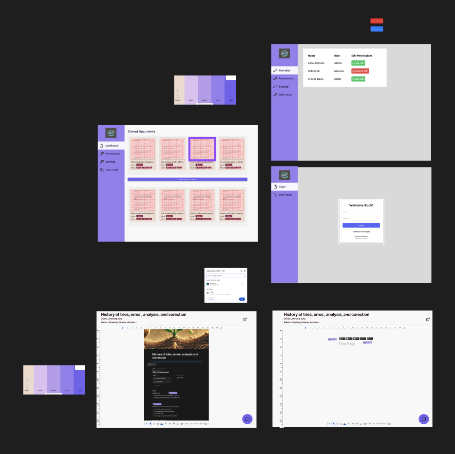

# Coediting_document_editor project

Frontend: Angular, GraphQL client  
Backend: Go, GraphQL  
DB: MYSQL, MongoDB  

## Description
like google docs, I am going to make a coediting document editor which you can edit in real time with a group of people you have granted access to.

## design plan

